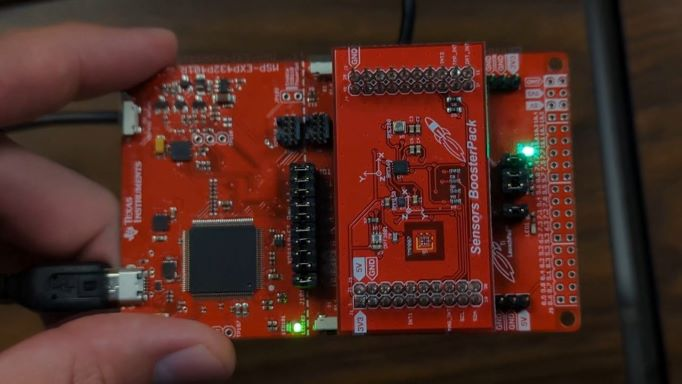

# Embedded Systems Final Project

This was a final project for an Embedded Systems class. The purpose of the project was to be able to have another board communicate with the TI MSP432 board we used for class. In order to do so, documentation, datasheets, and schematics must be read to gain an understanding of how the additional board works.

For this project, an addon board for the MSP432 was chosen that contains a variety of sensors. Specifically, a gyroscope is monitored and when it detects major rotation about the X, Y, or Z axis via UART transmission protocol it will light up an RGB LED on the MSP432 board.

This is a modification of the example sensor-gui project Texas Instruments provides with this addon board which is available in the SimpleLink SDK [here.](https://software-dl.ti.com/msp430/msp430_public_sw/mcu/msp430/BOOSTXL-SENSORS/latest/index_FDS.html) Look for the 'boostxl_sensors_sensorgui_msp432p401r_MSP_EXP432P401R_nortos_ccs' project and replace the main.c with the one provided here and flash with Code Composer Studio.

Note that the intervals used for s_gyroXYZ may depend on the board and it's sensor. For this board, the gyroscope values of X, Y, and Z at rest were around 100, -500, and 100 respectively. In addition, these at-rest values may skew the y-axis sensitivity when determining the dominant axis of motion. This could be solved by zeroing the at-rest values. In practice however, it was hard to notice any real issues with sensitivity.
